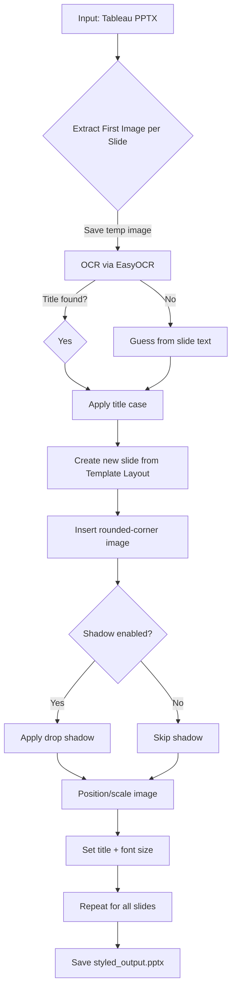
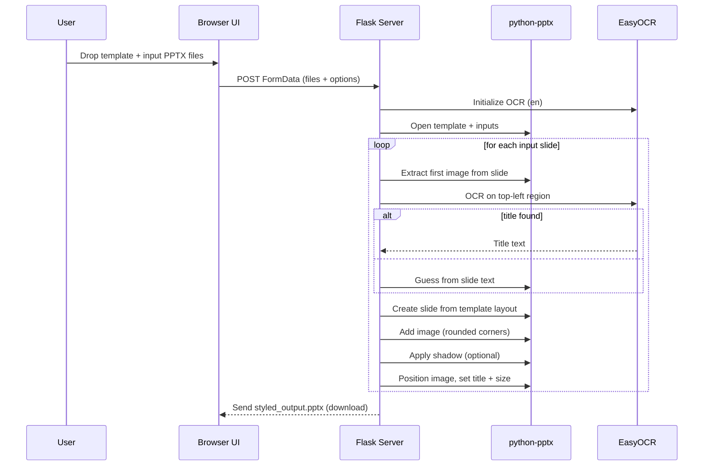

### PowerPoint Stylizer for Tableau Exports

Style Tableau-exported PowerPoint decks using a brand template. Works as a command‑line tool and a lightweight local web UI.

---

### Features
- **Smart title extraction**: OCR reads titles from dashboard images; falls back to slide text.
- **Brand application**: Uses your template `.pptx` to create on‑brand slides (masters, theme, slide numbers).
- **Image treatment**: Rounded corners and optional drop shadow with tunable parameters.
- **Precise placement**: Position and size exported dashboard images consistently.
- **Two entry points**: CLI (`style_tableau_pptx.py`) or local web UI (`style_pptx_web.py`).

---

### Requirements
- Python 3.9+
- PowerPoint dependencies and OCR:

```bash
pip install -r requirements.txt
```

Notes:
- The first run initializes EasyOCR and may download language data (~100MB).
- GPU is not required; the code initializes EasyOCR with `gpu=False`.

---

### Quick Start (CLI)

```bash
python style_tableau_pptx.py \
  --input tableau_export.pptx \
  --template brand_template.pptx \
  --output styled_output.pptx \
  --title-case smart \
  --title-font-size 28 \
  --border-radius 10 \
  --image-left 2.5 \
  --image-top 1.7 \
  --shadow-color 000000 \
  --shadow-transparency 0.8 \
  --shadow-blur 15 \
  --shadow-angle 34 \
  --shadow-distance 3
```

Key flags:
- `--input/-i`: Tableau‑exported `.pptx`.
- `--template/-t`: Brand template `.pptx` (masters, theme, slide numbers enabled).
- `--output/-o`: Output file path.
- `--title-case`: `smart | camel | upper | lower`.
- `--title-font-size`: Title font size in points.
- `--border-radius`: Rounded corner radius (pixels) for images.
- `--image-left`, `--image-top`: Placement in inches.
- `--shadow`/`--no-shadow`: Toggle drop shadow; control with color/transparency/blur/angle/distance.

---

### Quick Start (Web UI)

Run the local server:

```bash
python style_pptx_web.py
# or
FLASK_APP=style_pptx_web.py flask run --port 5001
```

Open `http://127.0.0.1:5001` and:
- Drop a brand template `.pptx`.
- Drop one or more Tableau‑exported decks (drag to reorder).
- Adjust options (title casing, font size, border radius, shadow controls, image placement).
- Click Process to download `styled_output.pptx`.

---

### How It Works

CLI flow:



Web UI flow:



---

### Tips
- Ensure your template enables slide numbers in the master if you want them visible.
- For best OCR results, export high‑resolution images; titles should appear top‑left on dashboards.
- Shadow color is RGB hex without `#` (e.g., `000000`).

---

### Files
- `style_tableau_pptx.py`: CLI tool and core slide/image logic.
- `style_pptx_web.py`: Flask web UI reusing the same logic.
- `requirements.txt`: Dependencies.
- `hero_image.png`: Optional hero image served by the web UI.

---

### License
MIT


