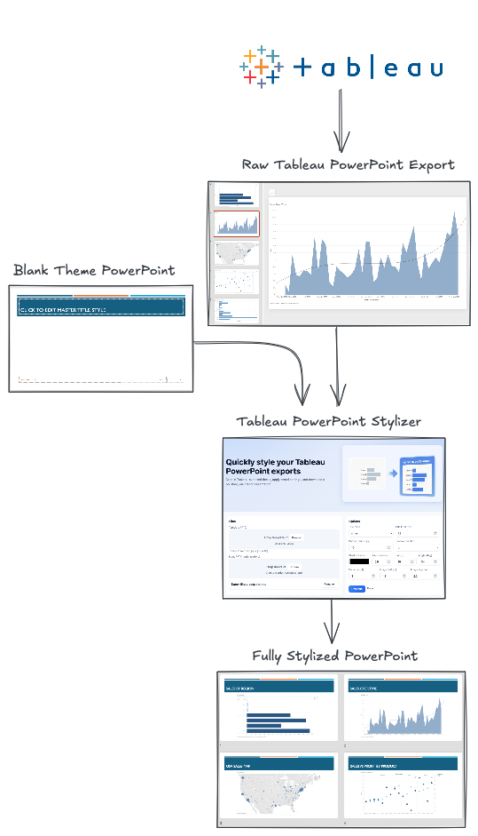

# PowerPoint Stylizer for Tableau Exports

Transform bland Tableau PowerPoint exports into polished, on-brand presentations—automatically.

## 🎯 The Problem

If you've ever exported dashboards from Tableau to PowerPoint, you know the pain:

- **Bland by default** — Tableau's native exports are functional but far from presentation-ready. No styling, no branding, just raw dashboard images.
- **Manual styling is tedious** — When you're exporting dozens of slides at once, manually adding titles, adjusting layouts, and applying brand guidelines can eat up hours.
- **Inconsistent results** — Hand-styling each slide often leads to inconsistent spacing, fonts, and formatting across your deck.

You need a way to batch-process your exports and make them look professional without the manual grind.

## ✨ What This Tool Does

**PowerPoint Stylizer** takes your Tableau-exported decks and automatically transforms them into polished, branded presentations.

### Key Features

🎨 **Batch Styling**  
Upload multiple PPTX files at once and apply consistent styling across all slides in seconds.

🤖 **Smart Title Extraction**  
Uses OCR to read the title directly from your dashboard image and adds it as proper slide text—no more title-less slides.

🎭 **Full Brand Control**  
Apply your template's theme, add rounded corners, drop shadows, custom fonts, and spacing. Everything is configurable.

📦 **Combine Multiple Decks**  
Merge several Tableau exports into a single presentation while maintaining consistent styling throughout.

## 🔄 How It Works



1. **Upload your template** — Provide a branded PowerPoint template with your organization's theme and master slides
2. **Add Tableau exports** — Drop in one or more Tableau-exported PPTX files (order matters if you're combining multiple decks)
3. **Configure styling** — Adjust title formatting, image positioning, shadows, and other visual options
4. **Process & download** — Get a polished, professional presentation in seconds

## 🚀 Getting Started

### Installation

```bash
pip install -r requirements.txt
```

*Note: On first run, the OCR engine will download language models (~100MB).*

### Web Interface

Run the Flask web app for an easy drag-and-drop interface:

```bash
python style_pptx_web.py
```

Then open your browser to `http://127.0.0.1:5001`

### Command Line

For scripting or batch processing, use the CLI:

```bash
python style_tableau_pptx.py \
  --input tableau_export.pptx \
  --template brand_template.pptx \
  --output styled_presentation.pptx \
  --title-case smart \
  --border-radius 10 \
  --shadow
```

### Options

- **Title Case** — Choose from smart, camel, upper, or lower case formatting
- **Image Positioning** — Control exactly where dashboard images appear on each slide
- **Shadows & Borders** — Add drop shadows with customizable color, blur, transparency, and angle
- **Rounded Corners** — Soften image edges with configurable border radius

## 📋 Requirements

- Python 3.7+
- `python-pptx` — PowerPoint manipulation
- `Pillow` — Image processing
- `easyocr` — OCR for title extraction
- `Flask` — Web interface
- `werkzeug` — File upload handling

## 💡 Tips

- **Template matters** — Your template PPTX should have slide numbers enabled and your preferred theme/master slides configured
- **Reordering slides** — In the web interface, you can drag and drop input files to change their order
- **Title extraction** — OCR works best when Tableau dashboard titles are in the top-left corner with good contrast

## 🎬 Example

See the `example_files/` directory for sample inputs and outputs demonstrating the transformation from a basic Tableau export to a fully styled presentation.

---

**Made with ☕ to save countless hours of manual PowerPoint styling**

